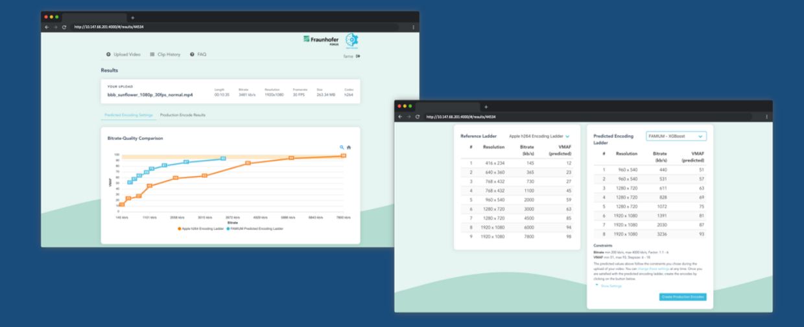

# AWT PJ WS 21/22 Deep Encode 2

Repository for training and evaluation of different machine learning models to reduce the number of test encodes needed to identify the optimal encoding settings.

There is a ReadMe.md for every Machine Learning Algorithm in their respective folders, just go to the src file and then enter the folder of your prefered machine learning Algorithm.
In this file, the process to run the gradient boosting decision model and Linear Regression is described. The instructions for the Convolutional Neural Network Model is in its folder and was
not presented in this file because of the installation, and requirements similarities with Gradient Boosting Decision Tree.
Note:
The instructions to run the python models are written for Linux, specifically Ubuntu 20.04.3 LTS while the Linear Regression Model (R) is meant for windows
## About Deep Encode

Video streaming content differs in terms of complexity and requires title-specific encoding settings to achieve a certain visual quality. Per-title encoding enables a more efficient and tailored video encoding ladder based on the complexity of a video. To take things a step further, per-scene encoding enables tailored video encoding ladders based on the complexity of each scene, rather than an entire video. However, conventional encoding solutions, such as per-title and per-scene, are computationally heavy and required a high amount of test encodes to identify the optimal encoding settings. The Deep Encode project utilizes machine learning models and provides encoding setting predictions in order to avoid the computationally heavy test encodes.

### Features
The scripts contained in the GBDT folder allow to:

1. Build a Gradient Boosting Decision Tree model and predict VMAF values using it.
2. Plot the data points(Bitrate/predcted VMAF) and calculate the convex hull in order to see how one resolution outperforms the other at a certain bitrate.
3. Build the encodding ladder and get the higher VMAF value at a certain bitrate using it.

### Development
Python:
The development is done using Python 3.9.7. The required moduls are matplotlib, numpy, pandans, scikit-learn, scipy.
R:
The development is done using R 4.1.0. The required moduls are dummies, ggplot2, metrics, ggally, dplyr,tidyr,forecast, ggmap, datetime, fpc
## Set up
### Requirements 📋
Python:
_**Git**_

```
sudo apt update
sudo apt install git
```

_**Python 3.9.9**_
```
sudo apt update
sudo apt install software-properties-common
sudo add-apt-repository ppa:deadsnakes/ppa
sudo apt update
sudo apt install python3
```
_**Install Pip**_
```
sudo apt install python3-pip
```

**virtualenv**

_install virtual env with_
```
pip install virtualenv
```

_create a directory to save virtual environments_
```
mkdir virtualenvs
cd virtualenvs
```

_Set the environment_
```
virtualenv env
```

_To activate use_
```
source env/bin/activate
```

_To deactivate it use_
```
source env/bin/deactivate
```
### Installation 🔧

_Follow these steps once done with the **Requirements**:_

_**NOTE: Keep your virtual environment activated for the installation.**


_clone the github repository without history (no need if you have the src folder, just extract in this case)_

```
git clone --depth 1 -b main https://git.tu-berlin.de/juliop1996/awt-pj-ws21-22-deepencode-2.git
```

_enter repository_

```
cd awt-pj-ws21-22-deepencode-2/src/GBDT
```


_A requirements file was generated that will allow the automatic installation of the modules with_

```
pip install -r requirements.txt
```
R:
_**R 4.1.2**_
```
download and install R  4.1.2
https://cran.r-project.org/bin/windows/base/

download and install R Studio
https://www.rstudio.com/products/rstudio/download/ 
(free version is enough)

```

_**open R Studio**_
```
Open awt-pj-ws21-22-deepencode-2\src\LineareRegression\DataInR.rmd with R Studio

```

## Run
### Build and Train the model
Python:
The script model-new.py builds the GBDT model and predicts the VMAF values in predicted_vmaf.csv.

to run this script (this can take some minutes):
`python model-new.py` 

R:
The script dataInR.rmd builds the Linear Regression model and predicts the VMAF values.

Run All 
### Plot bitrate/VMAF pairs
PYthon:
The script plot_bitrate_vmaf.py plots the data points(bitrate, predicted VMAF) and calculates the convexhull for each video ID and stores the graphs in the plot_with_convex_hull file.

to run this script:
`python plot_bitrate_vmaf.py`

R:
The dataFrame encoddingLadderFinished contains the final EncodingLadder (videoID, bitrate, resolution, maxVMAF)
### Build encoding ladder
The script build_encoding_ladder.py builds the bitrate/VMAF ladders for each video ID and stores it in bitrate_ladder excel file

to run this script:
`python build_encoding_ladder.py`

R:
The dataFrame encoddingLadderFinished contains the final EncodingLadder (videoID, bitrate, resolution, maxVMAF)

### Convex hull ###

The ConvexHull Graphs are saved as .png in the Folder.  

## Documentation
The Documentation is distributed in the following places:


- Code comments, which ensure readability
- Paper in the report folder
- Presentations in the presentation folder


## Authors

Team of Deep Encode (2)

-Vinzenz Jakob Benedikt Franke\
-Julio Cesar Perez Duran\
-Ruihan Zhang

## Contact

The team is available by the following emails:

Vinzenz Jakob Benedikt Franke: vinzenz.franke@campus.tu-berlin.de\
Julio Cesar Perez Duran: julio.cesar.perez.duran@campus.tu-berlin.de\
Ruihan Zhang: ruihan.zhang@campus.tu-berlin.de
